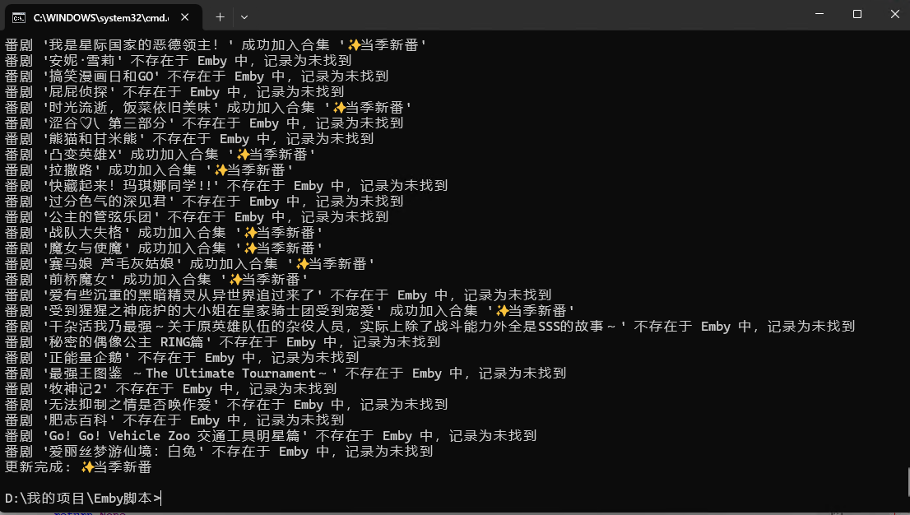
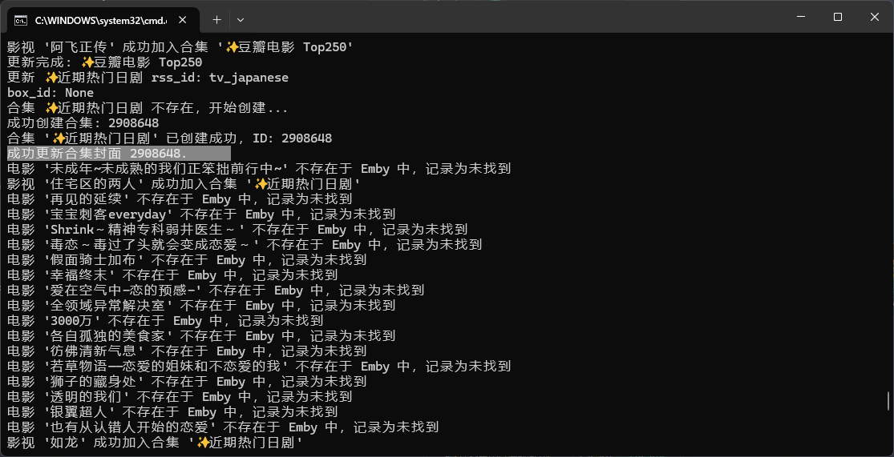

# Emby服务器自动创建热门影剧合集

啥都不会，AI写的。 脚本大概能用，应该。。。

写了个V1版，被大佬改良了一下， [https://github.com/xuanqb/EMBY_HotMovie_Importer](https://github.com/xuanqb/EMBY_HotMovie_Importer)  我又在他改良的基础上修改了一下才有这个项目，感谢开源

+ 2025年6月4日 新增bangumi当季新番的爬取并创建合集
  
+ 2025年6月6日 新增豆列的爬取并创建合集
  
+ 增加了合集封面创建，会自动指定合集内的某一个项目的封面作为该合集的封面，而不是默认的那种多图拼接的封面。
+ 已存在合集时，先清空合集，再添加新项目到合集内，保证每次随着榜单更新后的合集内容都是动态更新的
+ 2024年11月28日更新：未找到的电影会被记录到csv文件内，方便你添加订阅
+ - 创建的合集名前缀是✨号，是为了让新创建的合集再标题排序模式下靠前，如果不想要的话可以在主脚本内搜索替换

# 运行效果



# 运行向导

#### 1.Docker部署rsshub或者用官方的
如果需要TOP250的榜单能够获取250个数据，则需Docker部署大佬的RSSHub，官方的默认只能抓取10条

``` Bash
docker run -d --name rsshub --restart unless-stopped -p 1200:1200 -e NODE_ENV=production xuanqb/rsshub:latest
```

#### 3. 安装依赖&运行程序
```
pip install -r requirements.txt
python EMBY_HotMovie_Importer.py
```


#### 2. 修改config.conf配置文件
``` conf
[Server]
# 这里填入你Emby服务器地址
emby_server = http://xxx.xx.xx.x:8096
# 这里填入你Emby API密钥
emby_api_key = xxxxxxx
rsshub_server = http://xx.xx.x.x:1200
```

``` conf
[Collection]
# 各种榜单 按需自行选择
# 测试链接：http://{rsshub_server}/douban/movie/weekly/tv_hot

# | 分类名称                     | 对应代码                      |
# |------------------------------|-------------------------------|
# | 实时热门书影音               | subject_real_time_hotest      |
# | 影院热映                     | movie_showing                 |
# | 实时热门电影                 | movie_real_time_hotest        |
# | 实时热门电视                 | tv_real_time_hotest           |
# | 豆瓣TOPO250                  | movie_top250                  |
# | 一周口碑电影榜（推荐）       | movie_weekly_best             |
# | 豆瓣热门电影榜（推荐）       | movie_hot_gaia                |
# | 近期热门剧集（推荐）         | tv_hot                        |
# | 一周热门综艺榜               | show_hot                      |
# | 华语口碑剧集榜               | tv_chinese_best_weekly        |
# | 全球口碑剧集榜               | tv_global_best_weekly         |
# | 国内口碑综艺榜               | show_chinese_best_weekly      |
# | 国外口碑综艺榜               | show_global_best_weekly       |
# | 热播新剧国产剧               | tv_domestic                   |
# | 热播新剧欧美剧               | tv_american                   |
# | 热播新剧日剧                 | tv_japanese                   |
# | 热播新剧韩剧                 | tv_korean                     |
# | 近期热门动画                 | tv_animation                  |


rss_ids=tv_american,tv_domestic,tv_japanese,tv_animation,tv_korean

# 豆列部分
# 精选了一些豆列，你可以选择全部跑，也可以挑几个，或者自己去豆瓣创建
# https://www.douban.com/tag/%E7%94%B5%E5%BD%B1/?focus=doulist

# 测试链接：http://{rsshub_server}/douban/doulist/{doulist_ids}

# doulist_ids=248893,240962,243559,13729,243020,434035,119750,766707,201931,504289,47885,24213,223781,510983,425466,11868,249029,222008,855500,27868,240111,324040,585287,260994,270278,28129,51853,11568,426603,13922,165217,11324,26095,196781,88504,272366,259579,797422,752673,172901,212485,398254,691358,225067,234853,13370,252952,503616,306445,33979,16163,17470,257060,200218,240612,288371,174587,255134,800192,23910,217951,488705,28423,469329,728439,261318,131803,27530,150689,782551,133869,632240,14897,13919,480634,269207,25679,430230,109436,272899,197185,143801,400723,23940,779707,90119,11178,515203,132351,213847,931844,622939,419095,11169,595576,25685,30341,124455,120928,923727,107486,34652,770083,10685,449804,951633,170653,124440,28340,774265,34878,562705,11874,437751,63785,170501
doulist_ids=109436

```

